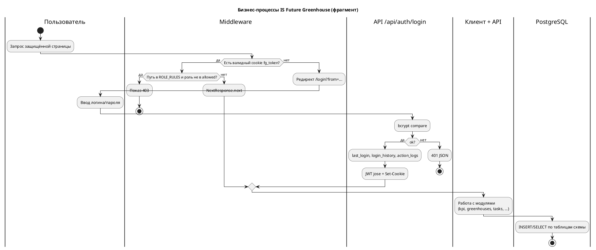
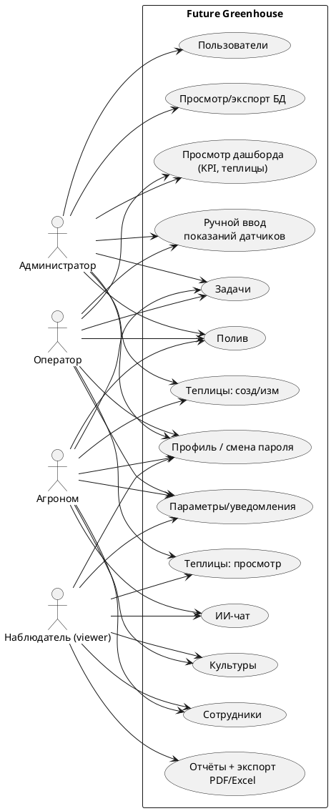
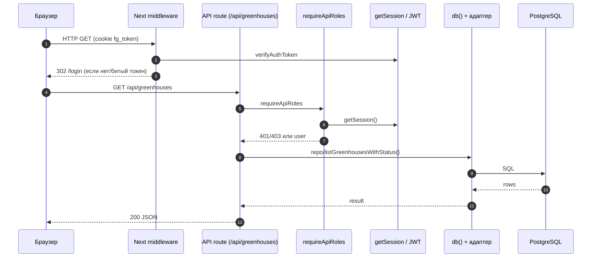
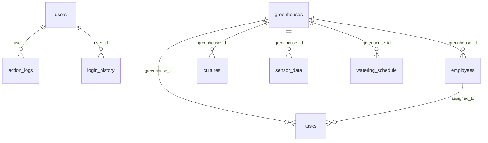
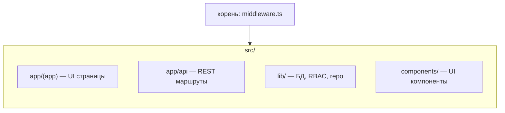
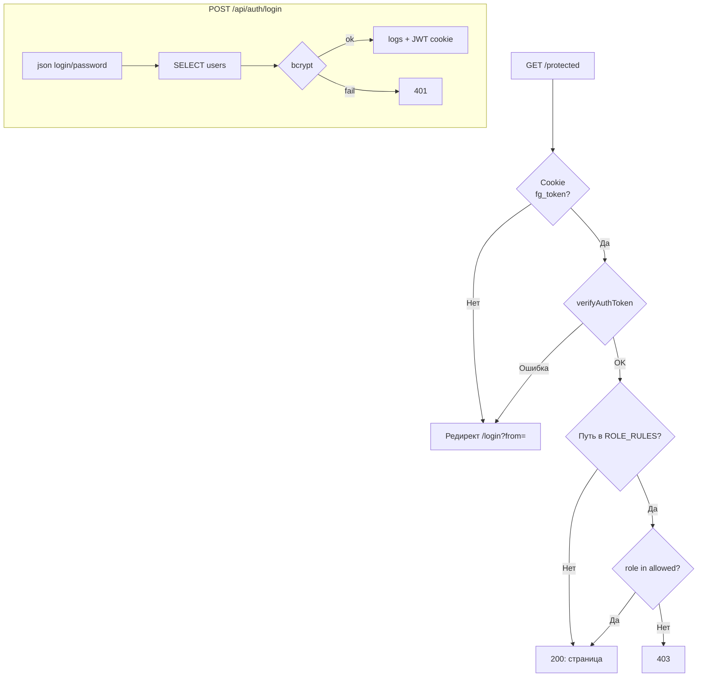
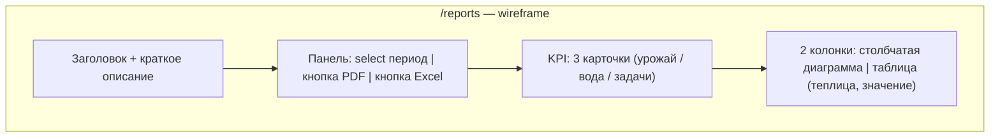

# Рисунки и диаграммы для диплома (Future Greenhouse)

Документ содержит готовый код диаграмм (Mermaid/PlantUML) для вставки в диплом и последующей генерации изображений (SVG/PNG).

---

## Сурет 1.1 — Диаграмма основных бизнес-процессов системы

**Тип:** Flowchart (Mermaid) с дорожками-имитацией (swimlanes) / Альтернатива: Activity Diagram (PlantUML) с дорожками.

**Подпись (пример):** *Рисунок 1.1 – Основные бизнес‑процессы информационной системы управления тепличным хозяйством Future Greenhouse.*

### Вариант A — Mermaid (flowchart, дорожки-имитация)

```mermaid
flowchart TB
  subgraph P1["Процесс 1. Доступ к системе"]
    direction TB
    S([Пользователь открывает защищённый URL]) --> M1{Cookie fg_token\nвалиден?}
    M1 -->|Нет| L[/Редирект на /login/]
    L --> F[Ввод логина и пароля]
    F --> A1[POST /api/auth/login]
    A1 --> Pw{Пароль совпал\nbcrypt?}
    Pw -->|Нет| F
    Pw -->|Да| Upd[UPDATE users.last_login]
    Upd --> H[INSERT login_history]
    H --> Al[INSERT action_logs: login]
    Al --> T[JWT (jose) → cookie]
    T --> M2{Роль ∈ allowed\nдля пути?}
    M2 -->|Нет| E403[/403 /rewrite/]
    M2 -->|Да| OK[Доступ к UI раздела]
  end

  subgraph P2["Процесс 2. Мониторинг и панель"]
    OK2([Авторизованный сеанс]) --> D1[GET /api/kpi]
    D1 --> R1[Репозиторий KPI\nDISTINCT ON sensor_data]
    OK2 --> D2[GET /api/greenhouses]
    D2 --> R2[Репозиторий greenhouses\n+ последние датчики + полив]
  end

  subgraph P3["Процесс 3. Оперативные данные (оператор / админ)"]
    OK3([Роль: admin, operator\nдля /sensor-entry]) --> SE[Страница /sensor-entry]
    SE --> PS[POST /api/sensors]
    PS --> SD[(sensor_data)]
  end

  subgraph P4["Процесс 4. Агрономия и планирование"]
    OK4([Роли: admin, agronomist\nчасть операций + viewer: чтение]) --> Cu[/Культуры /api/cultures/]
    --> Tsk[/Задачи /api/tasks/]
    --> Wt[/Полив /api/watering/]
  end

  subgraph P5["Процесс 5. Аналитика и экспорт"]
    OK5([Роли: admin, agronomist, viewer]) --> Rep[GET /api/reports?period=…]
    Rep --> X{Экспорт?}
    X -->|Нет| UI[UI: график Chart.js, таблица]
    X -->|Да, PDF| PDF[PDFKit: /api/reports&format=pdf]
    X -->|Да, Excel| XL[ExcelJS: /api/reports&format=excel]
  end

  subgraph P6["Процесс 6. Справочники и администрирование"]
    OK6[Админ] --> Uz[/Пользователи /api/users/]
    Uz --> Us[(users)]
    OK6 --> Db[/Служебный просмотр БД /api/db/]
    OK6 --> Log[/Логи /api/users/logs/]
  end

  subgraph P7["Процесс 7. Вспомогательные"]
    N1[GET/POST /api/notifications] --> N2[(notifications)]
    AI[POST/GET /api/ai] --> OAI[(OpenAI API + ai_chat_history)]
  end

  OK --> OK2
  OK2 -.-> OK3
  OK2 -.-> OK4
  OK2 -.-> OK5
  OK2 -.-> OK6
  OK2 -.-> P7
```

### Вариант B — PlantUML (activity, дорожки)



---

## Сурет 1.2 — Сравнение существующих решений по функциональности

**Тип:** сравнительная таблица (для Word — обычная таблица).

**Подпись (пример):** *Рисунок 1.2 – Сравнение существующих решений по функциональным возможностям.*

| Критерий | Условн. «1С + Excel» | SaaS/IoT-платформы (общий тип) | **Future Greenhouse (данный проект)** |
|----------|----------------------|---------------------------------|----------------------------------------|
| Веб-интерфейс, роли (RBAC) | Не профильное | Обычно да | **Да: admin, agronomist, operator, viewer** |
| Модель теплиц, нормы t/вл | Нет «из коробки» | Зависит | **greenhouses, cultures** |
| Данные датчиков | Вручную/внешне | Обычно IoT | **Ручной ввод: /sensor-entry → sensor_data** |
| Полив, задачи | Произвольно | Модули | **watering_schedule, tasks** |
| Отчёты PDF/Excel | Внешние средства | Дашборды | **/reports + /api/reports?format=pdf|excel** |
| Встроенный ИИ-чат | Обычно нет | Редко | **/api/ai + ai_chat_history + OpenAI** |
| Деплой | — | — | **Next.js + PostgreSQL (напр. Supabase)** |

---

## Сурет 1.3 — Use-case диаграмма ролей и функций системы

**Тип:** UML Use Case (PlantUML).

**Подпись (пример):** *Рисунок 1.3 – Диаграмма вариантов использования (Use‑Case) системы Future Greenhouse.*



---

## Сурет 2.1 — Архитектурная схема Future Greenhouse

**Тип:** компонентная диаграмма (Mermaid flowchart).

**Подпись (пример):** *Рисунок 2.1 – Архитектурная схема системы Future Greenhouse.*

```mermaid
flowchart TB
  subgraph Ext["Среда и внешние системы"]
    U[Браузер пользователя]
    OAI[api.openai.com\n(OpenAI API)]
  end

  subgraph Host["Next.js 16 (App Router), например Vercel"]
    subgraph FE["Client UI (React 19)"]
      P["Страницы: /login, /, /greenhouses, /reports, ..."]
    end
    MW[middleware.ts\nJWT verify, ROLE_RULES]
    API["Route Handlers\nsrc/app/api/.../route.ts"]
    LIB["lib: auth (jose), session, audit"]
    DBA["db: pg Pool, adapter, ensureDbReady"]
    REPO["repo: greenhouses.ts, kpi.ts"]
  end

  subgraph Data["Данные"]
    PG[(PostgreSQL\nSupabase / др.)]
  end

  U -->|HTTPS| P
  P -->|fetch| API
  API --> MW
  API --> LIB
  API --> DBA
  DBA --> REPO
  REPO --> DBA
  DBA --> PG
  API -->|/api/ai| OAI
```

---

## Сурет 2.2 — Последовательность обработки запроса

**Тип:** UML sequence (Mermaid).

**Подпись (пример):** *Рисунок 2.2 – Диаграмма последовательности обработки запроса к API (на примере получения списка теплиц).*



---

## Сурет 2.3 — ER-диаграмма базы данных

**Тип:** ER (Mermaid erDiagram).

**Подпись (пример):** *Рисунок 2.3 – ER‑диаграмма базы данных системы Future Greenhouse.*



---

## Сурет 2.4 — Структура директорий проекта

**Тип:** дерево/схема структуры (текст + упрощённая Mermaid).

**Подпись (пример):** *Рисунок 2.4 – Структура директорий проекта Future Greenhouse.*

```text
src/
  app/
    (app)/
    api/
    login/
  components/
  lib/
middleware.ts
```



---

## Сурет 2.5 — Схема процесса авторизации

**Тип:** Flowchart (Mermaid).

**Подпись (пример):** *Рисунок 2.5 – Схема процесса авторизации и проверки прав доступа в системе.*



---

## Сурет 2.6 — Схема слоев работы с БД

**Тип:** уровневой блок-схема (Mermaid).

**Подпись (пример):** *Рисунок 2.6 – Схема слоев доступа к данным и взаимодействия с базой данных.*

```mermaid
flowchart TB
  L1[UI: pages в app/(app)] --> L2[API: route.ts]
  L2 --> L3[RBAC + Zod]
  L3 --> L4[db: pool + adapter + ensureDbReady]
  L4 --> L5[repo: greenhouses, kpi]
  L4 --> L6[(PostgreSQL)]
```

---

## Сурет 2.9 — Страница отчетов с экспортом

**Тип:** предпочтительно скриншот реального UI; альтернативно — wireframe.

**Подпись (пример):** *Рисунок 2.9 – Страница «Отчёты»: выбор периода, KPI‑карточки, диаграмма, таблица и экспорт в PDF/Excel.*

### Wireframe (Mermaid)



