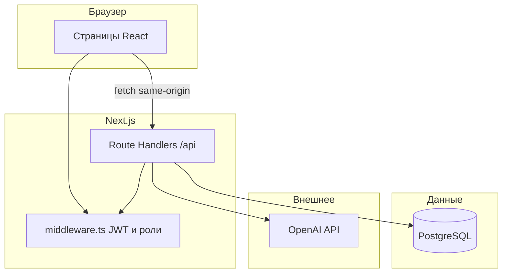

# Future Greenhouse — руководство к предзащите дипломного проекта

**Тема:** «Разработка информационной системы управления тепличным хозяйством Future Greenhouse с использованием современных технологий программирования».

Документ составлен **только по коду и конфигурации репозитория** `future-greenhouse`. Если функция в коде не найдена — это явно указано.

---

## 1. Общее описание проекта

### Что это за система

**Future Greenhouse** — веб-приложение (информационная система) для учёта и мониторинга тепличного хозяйства: теплицы, сотрудники, культуры, показания датчиков (температура, влажность, CO₂), расписание полива, задачи, уведомления, отчёты и чат с ИИ на базе данных теплиц.

### Для чего предназначена

- Централизованно видеть состояние теплиц и культур.
- Планировать полив и задачи, закреплять ответственных.
- Фиксировать показания датчиков (автоматически через симулятор/внешний процесс или вручную через форму).
- Получать агрегированные отчёты (JSON в интерфейсе, экспорт **PDF** и **Excel**).
- Получать текстовые рекомендации от **OpenAI** с подмешиванием актуальных данных из БД.

### Какие проблемы решает

| Проблема | Как решается в проекте |
|----------|-------------------------|
| Разрозненные данные | Одна PostgreSQL-база, согласованная схема таблиц |
| Разный доступ сотрудников | Роли `admin`, `director`, `agronomist`, `worker` + middleware и проверки в API |
| Наглядность | Дашборд с Chart.js, страница параметров с графиками |
| Отчётность для руководства | Страница «Отчёты», API с выгрузкой PDF/Excel |
| Быстрые консультации | Раздел AI: контекст из БД + модель `gpt-4o-mini` |

### Кто пользователи

По модели ролей в коде (`src/lib/auth.ts`, `middleware.ts`, `src/lib/api/rbac.ts`):

- **Администратор** — полный доступ, в т.ч. пользователи, просмотр БД, удаление теплиц.
- **Директор** — просмотр и отчёты; разделы культур, отчётов, AI открыты по правилам middleware (нет отдельного «только чтение» на уровне всех API — детали уточнять по конкретному `requireApiRoles` в маршруте).
- **Агроном** — создание/редактирование теплиц, культур, полива, задач (где разрешено в API).
- **Рабочий** — свои задачи, ручной ввод датчиков (`/sensor-entry`), отметка полива (см. UI/API полива).

---

## 2. Технологический стек

### Язык

- **TypeScript** — весь исходный код приложения и скриптов.

### Фреймворк и UI

- **Next.js 16** (App Router) — маршруты `src/app/`, серверные Route Handlers `src/app/api/**/route.ts`, middleware.
- **React 19** — клиентские компоненты (`"use client"`).
- **Tailwind CSS 4** — стили (`src/app/globals.css`, утилитарные классы).

### Библиотеки (основные)

См. также раздел 8; здесь — кратко «зачем».

| Область | Библиотека |
|---------|------------|
| БД | `pg` — пул подключений к PostgreSQL |
| Валидация | `zod` — схемы входных данных API |
| Аутентификация | `jose` — подпись и проверка JWT |
| Пароли | `bcryptjs` — хеширование и сравнение паролей |
| Графики | `chart.js`, `react-chartjs-2` |
| Отчёты Excel | `exceljs` |
| Отчёты PDF | `pdfkit` (+ шрифт DejaVu в `public/fonts/` для кириллицы) |
| ИИ | `openai` — официальный SDK, модель в коде: **`gpt-4o-mini`** (`src/app/api/ai/route.ts`) |

### База данных

- **PostgreSQL** (в продакшене типично **Supabase** как хостинг БД — строка `DATABASE_URL` из переменных окружения).

### Инструменты разработки и качество

- **Node.js 20.x** (задано в `package.json` → `engines`).
- **ESLint** + **eslint-config-next**.
- **Vitest** — unit-тесты (`npm test`).
- **Playwright** — e2e smoke «логин + KPI» (`npm run test:e2e`).
- **tsx** — выполнение CLI-скриптов миграций/сида (`scripts/db.ts`).

### Где размещён проект

- Типичный сценарий из README и обсуждений в проекте: **Vercel** (сборка `next build`, переменные окружения в панели Vercel). Отдельного `vercel.json` в репозитории может не быть — деплой настраивается в UI Vercel (подключение к GitHub, branch `main`).

### Почему выбраны эти технологии (аргументация для комиссии)

- **Next.js** — один проект для UI и API, SSR/ISR не обязательны, но удобны Route Handlers и единая типизация.
- **PostgreSQL** — надёжная реляционная модель для связей «теплица — культура — датчик — полив — задача».
- **JWT в httpOnly cookie** — стандартный подход для stateless-сессии между клиентом и serverless-функциями.
- **OpenAI** — быстрый способ добавить «умный» слой поверх структурированных данных без собственной ML-модели.

---

## 3. Архитектура проекта

### Из каких частей состоит

1. **Клиент (браузер)** — React-страницы в `src/app/(app)/`, форма входа `src/app/login/`.
2. **Middleware** (`middleware.ts`) — проверка JWT для всех путей кроме публичных; редирект на `/login`; проверка ролей по префиксам URL → `/403`.
3. **Backend** — Route Handlers `src/app/api/*/route.ts` (серверный код Node.js).
4. **База данных** — PostgreSQL, доступ через адаптер `src/lib/db.ts` + `src/lib/db/adapter.ts` (SQL с `?` → позиционные параметры `$1`… для `pg`).
5. **Внешние сервисы** — OpenAI API (ключ из `OPENAI_API_KEY`); опционально **quickchart.io** для PNG-графиков в Excel-отчёте (сетевой запрос при экспорте).

### Как взаимодействуют части

**Простыми словами:** пользователь логинуется → сервер ставит **защищённую cookie** с JWT → дальше каждый запрос к страницам идёт через **middleware** (есть ли валидный токен и подходит ли роль) → страницы дергают **REST API** (`/api/...`) → API читает/пишет **PostgreSQL** → для AI API дополнительно читает БД, собирает текст-контекст и вызывает **OpenAI**.

---

## 4. Структура файлов и папок

### Корень проекта

| Путь | Назначение |
|------|------------|
| `package.json` | Зависимости, скрипты `dev`, `build`, `db:*`, `test`, `sensors:simulate` |
| `next.config.ts` | Настройки Next (например `serverExternalPackages: ["pdfkit"]`) |
| `middleware.ts` | Глобальная защита маршрутов |
| `playwright.config.ts` | E2E-тесты |
| `vitest.config.ts` | Unit-тесты |
| `README.md` | Быстрый старт, переменные окружения, роли, симулятор датчиков |
| `public/fonts/DejaVuSans.ttf` | Шрифт для PDF с кириллицей |

### `src/app/`

| Путь | Назначение |
|------|------------|
| `layout.tsx` | Корневой layout: шрифт Inter, `viewport`, тема |
| `globals.css` | Глобальные стили Tailwind, CSS-переменные тем |
| `(app)/` | Защищённые страницы приложения (дашборд, теплицы, …) |
| `(app)/layout.tsx` | Обёртка `AppShell` (сайдбар, топбар, мобильное меню) |
| `login/` | Страница входа |
| `403/` | Страница «доступ запрещён» |
| `api/**/route.ts` | Серверные API-маршруты |

### `src/components/`

- `layout/` — `AppShell`, `Sidebar`, `Topbar`, `MobileNavDrawer`, навигация `nav.ts`.
- `ui/` — переиспользуемые UI: `Card`, `RippleButton`, `AppModal`, `TableScroll`, …
- `auth/`, `i18n/`, `theme/` — контексты и инициализация.

### `src/lib/`

| Файл/папка | Назначение |
|-------------|------------|
| `db.ts` | Пул `pg`, SSL-настройки для Vercel/Supabase, `ensureDbReady` |
| `db/schema.ts` | `CREATE TABLE IF NOT EXISTS` — начальная схема |
| `db/migrations.ts` | Идемпотентные миграции (типы дат, индексы, `login_history`, поля TOTP и т.д.) |
| `db/seed.ts` | Демо-данные (в т.ч. пользователь admin при сиде) |
| `db/adapter.ts` | Преобразование SQL `?` → `$n` для `pg` |
| `auth.ts` | JWT, cookie `fg_token`, `attachAuthCookie` |
| `session.ts` | `getSession()` из cookie для API |
| `env.ts` | Обязательные переменные: `JWT_SECRET`, `DATABASE_URL`, `OPENAI_API_KEY` |
| `rbac.ts` | `hasRole`, подписи ролей |
| `api/rbac.ts` | `requireApiRoles` для API |
| `audit.ts` | Запись в `action_logs` |
| `repo/` | Выборки для отчётов/дашборда (например `greenhouses.ts`, `kpi.ts`) |

### `scripts/`

- `db.ts` — CLI: `migrate`, `seed`, `setup`.
- `sensors-simulate.ts` — фоновый процесс вставки строк в `sensor_data`.

### Откуда «запускается» проект

- **Разработка:** `npm run dev` → Next.js dev server (порт по умолчанию 3000).
- **Продакшен-сборка:** `npm run build` → `npm run start`.
- **Первая инициализация БД (локально):** `npm run db:setup` (или отдельно `db:migrate` / `db:seed`).

---

## 5. Основные модули системы

Ниже — **назначение**, **функции**, **файлы**, **данные** по факту из кода.

### 5.1 Теплицы

- **Назначение:** Справочник теплиц: тип, площадь, нормы температуры/влажности, статус, примечания, опционально ответственный сотрудник.
- **Функции:** Просмотр списком с последними показаниями датчиков (через репозиторий `listGreenhousesWithStatus`), создание/изменение (admin, agronomist), удаление (**только admin**).
- **Файлы:** `src/app/(app)/greenhouses/page.tsx`, `src/app/api/greenhouses/route.ts`, `src/lib/repo/greenhouses.ts`.
- **Данные:** таблица `greenhouses` (`schema.ts`).

### 5.2 Культуры

- **Назначение:** Учёт культур по теплице: сроки посева/сбора, нормы, стадия, заметки.
- **Функции:** CRUD через API (роли в API — см. `cultures/route.ts`); UI с фильтрами и модальной формой.
- **Файлы:** `src/app/(app)/cultures/page.tsx`, `src/app/api/cultures/route.ts`.
- **Данные:** `cultures` (FK на `greenhouses`).

### 5.3 Сотрудники

- **Назначение:** Кадры: ФИО, должность, привязка к теплице, телефон, статус смены, заметки, счётчик задач (агрегат в выборке API).
- **Функции:** Список, фильтры, создание/редактирование (**только admin** в `employees/route.ts`).
- **Файлы:** `src/app/(app)/employees/page.tsx`, `src/app/api/employees/route.ts`.
- **Данные:** `employees`; связь с `greenhouses` через `greenhouse_id`.

### 5.4 Задачи

- **Назначение:** Постановка задач с приоритетом, дедлайном, исполнителем (сотрудник) и теплицей.
- **Функции:** Создание/обновление (**admin, agronomist**); список; для **worker** — только задачи, где `assigned_to` совпадает с `users.employee_id`.
- **Файлы:** `src/app/(app)/tasks/page.tsx`, `src/app/api/tasks/route.ts`.
- **Данные:** `tasks` (FK на `employees`, `greenhouses`).

### 5.5 Показатели (температура, влажность, CO₂)

- **Назначение:** Хранение временных рядов `sensor_data` по теплице.
- **Функции:**  
  - GET: текущие/исторические данные для графиков и дашборда (см. `sensors/route.ts`, query-параметры).  
  - POST: вставка показания (с опциональным `recorded_by_user_id` для ручного ввода — миграция добавляет колонку).  
  - Режим `recent=1` для worker/admin — последние записи пользователя.
- **Файлы:** `src/app/(app)/parameters/page.tsx`, `src/app/(app)/sensor-entry/page.tsx`, `src/app/api/sensors/route.ts`, `scripts/sensors-simulate.ts`.
- **Данные:** `sensor_data`.

### 5.6 Полив

- **Назначение:** Расписание полива: тип, время, длительность, объём, флаг выполнения.
- **Функции:** Просмотр таймлайна, добавление записей (по ролям в API), отметка выполнено (**worker** или **admin** в `watering/route.ts`), удаление при правах.
- **Файлы:** `src/app/(app)/watering/page.tsx`, `src/app/api/watering/route.ts`.
- **Данные:** `watering_schedule`.
- **Замечание:** в UI есть заглушка «редактирование полива» через `alert` — **полноценная форма редактирования в текущей версии не реализована** (по коду страницы полива).

### 5.7 Отчёты

- **Назначение:** Агрегированные KPI за период (день/неделя/месяц/год), графики, таблица урожая по теплицам; экспорт.
- **Функции:**  
  - UI: `reports/page.tsx` — загрузка JSON с `/api/reports`.  
  - API: `GET /api/reports?period=…&format=json|pdf|excel` — расчёты SQL + Chart.js-данные для страницы; PDF через PDFKit; Excel через ExcelJS (в т.ч. опциональные PNG через quickchart.io при наличии сети).
- **Файлы:** `src/app/(app)/reports/page.tsx`, `src/app/api/reports/route.ts`.
- **Данные:** `watering_schedule`, `tasks`, `cultures`, `sensor_data` и др. (см. SQL внутри `buildReport` в `reports/route.ts`).

### 5.8 AI-рекомендации

- **Назначение:** Диалог с моделью, «обогащённый» сводкой по теплицам из БД (все или выбранная теплица).
- **Функции:**  
  - GET — история из `ai_chat_history` (до 200 сообщений).  
  - POST — валидация тела (`message`, опционально `greenhouse_id`), сбор `systemPrompt` из SQL, последние 40 сообщений истории, вызов **`chat.completions.create`**, модель **`gpt-4o-mini`**, сохранение user/assistant в БД.
- **Файлы:** `src/app/(app)/ai/page.tsx`, `src/app/api/ai/route.ts`.
- **Данные:** `ai_chat_history`; контекст из `greenhouses`, `sensor_data`, `watering_schedule`, `tasks`, `cultures`.

### 5.9 Авторизация и пользователи

- **Назначение:** Вход по логину/паролю, JWT в cookie `fg_token` (httpOnly, secure в production), роль в токене.
- **Функции:**  
  - `POST /api/auth/login` — проверка `users`, `bcryptjs.compareSync`, обновление `last_login`, попытка записи `login_history` / `action_logs` в try/catch.  
  - `POST /api/auth/logout` — очистка cookie.  
  - `GET /api/auth/me` — текущий пользователь.  
  - CRUD пользователей — `api/users`, страница `/users` (**admin**).
- **Файлы:** `src/app/login/`, `src/app/api/auth/*`, `src/lib/auth.ts`, `middleware.ts`, `src/app/(app)/users/page.tsx`.

### 5.10 Прочие заметные разделы

- **Уведомления:** `notifications` + API `api/notifications` + страница; счётчик непрочитанных в топбаре.
- **Профиль:** смена ФИО и пароля, таблица истории входов (`login_history`) — `profile/page.tsx`, `api/profile`, `api/profile/password`.
- **БД (админ):** страница `/db` + `api/db` — просмотр таблиц, фильтры, **опасные** операции редактирования строк с предупреждением в UI (см. тексты на странице).
- **Дашборд:** агрегаты KPI + графики — `api/kpi`, `DashboardClient.tsx`.

---

## 6. Структура данных

Источник правды по полям и ограничениям: **`src/lib/db/schema.ts`** + дополнения из **`src/lib/db/migrations.ts`**.

### Сущности (таблицы)

| Таблица | Назначение |
|---------|------------|
| `users` | Пользователи: логин, хеш пароля, роль, связь с сотрудником, активность |
| `action_logs` | Журнал действий (аудит) |
| `login_history` | История входов (IP, user-agent) — создаётся миграцией |
| `greenhouses` | Теплицы |
| `employees` | Сотрудники |
| `cultures` | Культуры |
| `sensor_data` | Показания датчиков; опционально `recorded_by_user_id` (миграция) |
| `watering_schedule` | Полив |
| `tasks` | Задачи |
| `notifications` | Уведомления |
| `ai_chat_history` | История чата ИИ |
| `app_settings` | Ключ-значение настройки |

### Поля и связи (кратко)

- **`users.role`:** `CHECK` на `admin|director|agronomist|worker`; `employee_id` — опциональная связь с `employees`.
- **`employees.greenhouse_id`** → `greenhouses(id)` ON DELETE SET NULL.
- **`cultures.greenhouse_id`**, **`sensor_data.greenhouse_id`**, **`watering_schedule.greenhouse_id`** → `greenhouses` ON DELETE CASCADE.
- **`tasks.assigned_to`** → `employees`; **`tasks.greenhouse_id`** → `greenhouses`.

### Как данные передаются

- Клиент ↔ сервер: **JSON** по HTTP (`fetch`).
- Сервер ↔ БД: **SQL** через пул `pg`.
- Сессия: **JWT** в cookie, не в `localStorage` (секрет `JWT_SECRET`).

---

## 7. Алгоритмы и бизнес-логика (по шагам)

### Добавление теплицы

1. Пользователь с ролью **admin** или **agronomist** отправляет `POST /api/greenhouses` с JSON (имя, тип, площадь, min/max температуры и влажности, опционально статус, ответственный, заметки).
2. **Zod** валидирует тело.
3. `INSERT INTO greenhouses …`.
4. Запись в **`action_logs`** через `auditLog`.

### Добавление культуры

1. `POST /api/cultures` (роли — по `cultures/route.ts`, обычно admin/agronomist).
2. Валидация, `INSERT` в `cultures` с привязкой к `greenhouse_id`.
3. Аудит.

### Создание задачи

1. `POST /api/tasks` — только **admin** или **agronomist**.
2. Вставка в `tasks` с полями title, description, assigned_to, greenhouse_id, priority, deadline.

### Фиксация температуры/влажности/CO₂

1. **Автоматизация:** скрипт `npm run sensors:simulate` вставляет строки в `sensor_data` (без привязки к пользователю, если не задано в скрипте — уточнять по `scripts/sensors-simulate.ts`).
2. **Вручную:** форма `/sensor-entry` → `POST /api/sensors` (роли в route), опционально время `recorded_at`, заполнение `recorded_by_user_id` для учёта источника (логика в `sensors/route.ts`).

### Полив

1. Создание: `POST /api/watering` при наличии прав.
2. Отметка «выполнено»: соответствующий метод в `watering/route.ts` (переключение `is_done`) — для **worker** и **admin** (как в коде API).

### Формирование отчётов

1. `GET /api/reports?period=…` — сбор KPI SQL-интервалами (`interval` в Postgres), данные для графиков, таблица по теплицам.
2. `format=pdf` — генерация PDF в памяти (буферы), шрифт с кириллицей из `public/fonts/DejaVuSans.ttf`.
3. `format=excel` —_workbook ExcelJS_, при возможности — внешний PNG графика.

### AI-рекомендация

1. Клиент шлёт `POST /api/ai` `{ message, greenhouse_id? }`.
2. Сервер собирает текстовый контекст из БД (`buildGreenhouseContext` или `buildSingleGreenhouseContext`).
3. Формируется массив сообщений: system + история + user.
4. Вызов OpenAI, ответ сохраняется в `ai_chat_history`, клиент получает `{ ok, reply }`.

### Проверки данных

- **Zod** на входе почти всех POST/PUT API.
- **Роли:** `requireApiRoles` в API + `middleware` для страниц.
- **Ограничения БД:** `CHECK` на перечислениях (статус теплицы, стадия культуры, приоритет задачи и т.д.).

---

## 8. Используемые библиотеки (детально)

| Пакет | Для чего | Где |
|-------|----------|-----|
| `next` | Фреймворк, маршрутизация, сборка | весь проект |
| `react`, `react-dom` | UI | `src/app`, `src/components` |
| `typescript` | Типизация | везде |
| `tailwindcss` | Стили | классы в компонентах, `globals.css` |
| `pg` | Драйвер PostgreSQL | `src/lib/db.ts` |
| `zod` | Валидация запросов | `src/app/api/**` |
| `jose` | JWT | `src/lib/auth.ts` |
| `bcryptjs` | Пароли | `api/auth/login`, `api/users`, `api/profile/password`, `seed` |
| `openai` | Чат-модель | `api/ai/route.ts` |
| `chart.js`, `react-chartjs-2` | Графики | дашборд, параметры, отчёты |
| `exceljs` | Excel-отчёт | `api/reports/route.ts` |
| `pdfkit` | PDF-отчёт | `api/reports/route.ts` |
| `vitest` | Unit-тесты | `tests/unit` |
| `@playwright/test` | E2E | `tests/e2e` |
| `tsx` | Запуск TS-скриптов | `scripts/db.ts`, `scripts/sensors-simulate.ts` |
| `eslint`, `eslint-config-next` | Линтинг | `npm run lint` |

---

## 9. API и интеграции

### Внутренние API (все Route Handlers в репозитории)

По одному файлу `route.ts` на путь (всего **21** маршрут):

| Путь API | Файл |
|----------|------|
| `/api/auth/login` | `src/app/api/auth/login/route.ts` |
| `/api/auth/logout` | `src/app/api/auth/logout/route.ts` |
| `/api/auth/me` | `src/app/api/auth/me/route.ts` |
| `/api/users` | `src/app/api/users/route.ts` |
| `/api/users/logs` | `src/app/api/users/logs/route.ts` |
| `/api/profile` | `src/app/api/profile/route.ts` |
| `/api/profile/password` | `src/app/api/profile/password/route.ts` |
| `/api/greenhouses` | `src/app/api/greenhouses/route.ts` |
| `/api/cultures` | `src/app/api/cultures/route.ts` |
| `/api/employees` | `src/app/api/employees/route.ts` |
| `/api/tasks` | `src/app/api/tasks/route.ts` |
| `/api/sensors` | `src/app/api/sensors/route.ts` |
| `/api/watering` | `src/app/api/watering/route.ts` |
| `/api/notifications` | `src/app/api/notifications/route.ts` |
| `/api/kpi` | `src/app/api/kpi/route.ts` |
| `/api/reports` | `src/app/api/reports/route.ts` |
| `/api/ai` | `src/app/api/ai/route.ts` |
| `/api/db` | `src/app/api/db/route.ts` |
| `/api/db/export` | `src/app/api/db/export/route.ts` |
| `/api/cron/sensor-simulation` | `src/app/api/cron/sensor-simulation/route.ts` |
| `/api/admin/sensor-simulation` | `src/app/api/admin/sensor-simulation/route.ts` |

### OpenAI / ChatGPT

- **Используется:** да, через пакет `openai`.
- **Запрос:** серверный `POST /api/ai`, метод `client.chat.completions.create`.
- **Ответ:** текст из `completion.choices[0].message.content`, отдаётся клиенту JSON-ом и пишется в `ai_chat_history`.
- **Ключ:** переменная окружения **`OPENAI_API_KEY`** (обязательна для старта приложения — см. `src/lib/env.ts`).

### Другие внешние вызовы

- **`https://quickchart.io/chart`** — при экспорте Excel для встраивания PNG (если сеть недоступна, график в Excel может отсутствовать — по логике `fetchQuickChartPng`).

### Риски безопасности (честно для комиссии)

- **Секреты в env:** утечка `JWT_SECRET` или `OPENAI_API_KEY` компрометирует систему/биллинг OpenAI.
- **ИИ видит агрегированные данные теплиц** в system prompt — нужна политика не вводить персональные/чувствительные данные в свободный текст пользователя (контроль на уровне процесса).
- **Страница `/db`** для admin — потенциально опасные операции; важны роль, парольная политика, HTTPS на проде.
- **Нет отдельного rate-limit на AI в коде** (на уровне приложения) — при необходимости ограничивать на Vercel/WAF или добавлять в код.

---

## 10. Деплой

### Vercel (типовой сценарий)

1. Репозиторий на **GitHub** подключён к проекту Vercel.
2. Push в ветку (обычно `main`) запускает **`npm install`** и **`npm run build`**.
3. В панели задаются переменные: **`DATABASE_URL`**, **`JWT_SECRET`**, **`OPENAI_API_KEY`**, при необходимости `DB_AUTO_INIT`, `DB_AUTO_SEED`, `DATABASE_SSL_REJECT_UNAUTHORIZED`, `LOGIN_DEBUG` и др.

### Команды

| Команда | Назначение |
|---------|------------|
| `npm install` | Установка зависимостей |
| `npm run dev` | Локальная разработка |
| `npm run build` | Продакшен-сборка |
| `npm run start` | Запуск после сборки |
| `npm run db:migrate` | Миграции |
| `npm run db:seed` | Сид |
| `npm run db:setup` | migrate + seed |

### Файлы, влияющие на деплой

- `package.json` (`engines`, scripts, dependencies)
- `next.config.ts`
- Переменные окружения **на хостинге** (не коммитить `.env` в git — в `.gitignore`)

### Запуск на другом ПК

1. Клонировать репозиторий.
2. `npm install`.
3. Создать `.env.local` по образцу из `README.md`.
4. `npm run db:setup` (если нужна БД с нуля) или подключить существующую Supabase и выполнить `npm run db:migrate`.
5. `npm run dev`.

---

## 11. GitHub

### Как устроен репозиторий

- Обычно один основной репозиторий, ветка **`main`**, коммиты с изменениями фич (авторизация, отчёты, мобильная вёрстка, PDF-шрифты и т.д.). Точная история коммитов — **на GitHub в веб-интерфейсе** (`git log` / вкладка Commits).

### Зачем GitHub

- Версионирование кода, резервная копия.
- Связка с **Vercel** для автодеплоя.
- Возможность code review и issues (если используются).

### Как объяснить комиссии

«Исходный код хранится в распределённой системе контроля версий Git, удалённый репозиторий размещён на GitHub. Это позволяет отслеживать изменения, восстанавливать предыдущие версии и автоматически собирать приложение на хостинге после push.»

---

## 12. Возможные вопросы комиссии и ответы (30+)

1. **Почему тема актуальна?** — Теплицы требуют мониторинга климата и планирования работ; ИС снижает ошибки учёта и ускоряет решения.
2. **Что такое Future Greenhouse одним предложением?** — Веб-система учёта теплиц, датчиков, полива и задач с отчётами и ИИ-помощником.
3. **Почему TypeScript?** — Меньше ошибок на этапе разработки, единый язык на клиенте и сервере Next.js.
4. **Почему Next.js, а не «голый» React?** — Встроенные API routes, middleware, единая сборка и деплой.
5. **Почему PostgreSQL?** — Реляционная модель, целостность по FK, сложные отчёты SQL.
6. **Почему JWT?** — Удобно для serverless: не хранить сессии в памяти сервера.
7. **Почему cookie httpOnly?** — Защита от кражи токена скриптами в браузере (XSS всё ещё опасен, но токен не в JS).
8. **Как устроен вход?** — POST `/api/auth/login`, проверка пароля bcrypt, выпуск JWT, `Set-Cookie`.
9. **Где хранятся пароли?** — Только хеш в таблице `users`.
10. **Какие роли и зачем?** — Четыре роли; разделение обязанностей от админа до рабочего.
11. **Где проверяются права?** — В `middleware.ts` для страниц и в `requireApiRoles` для API.
12. **Что такое middleware?** — Код на границе запроса до страницы: редирект на логин или 403.
13. **Как добавляется теплица?** — POST `/api/greenhouses`, валидация Zod, INSERT, аудит.
14. **Как добавляется культура?** — POST `/api/cultures`, связь с `greenhouse_id`.
15. **Как создаётся задача?** — POST `/api/tasks`, приоритет и дедлайн, исполнитель — сотрудник.
16. **Как worker видит только свои задачи?** — В GET `/api/tasks` фильтр по `employee_id` из таблицы `users`.
17. **Откуда берутся данные датчиков?** — Таблица `sensor_data`; заполнение симулятором или ручным POST.
18. **Что такое симулятор?** — Отдельный процесс `sensors-simulate.ts`, периодически INSERT в БД.
19. **Как строятся графики?** — Chart.js на клиенте, данные с `/api/kpi` и `/api/sensors`.
20. **Как формируется PDF?** — PDFKit на сервере, шрифт DejaVu для кириллицы.
21. **Как работает AI?** — Контекст из SQL + история чата + вызов `gpt-4o-mini`.
22. **Где ключ OpenAI?** — Только в переменных окружения сервера, не в клиенте.
23. **Что если нет интернета у сервера к OpenAI?** — Запрос упадёт, клиент получит ошибку; нужна обработка/повтор (в текущей версии — стандартный ответ об ошибке сети на UI).
24. **Как обеспечивается безопасность API?** — JWT + проверка ролей + валидация входа.
25. **Есть ли SQL-инъекции?** — Используются параметризованные запросы через адаптер `pg`.
26. **Чем полезно внедрение?** — Единое окно для агронома и руководства, отчёты, трекинг полива и задач.
27. **Что можно улучшить?** — Rate limit на AI, 2FA в UI (поля TOTP в БД есть, полный UX не описан в UI), редактирование полива без `alert`, push-уведомления.
28. **Какие ограничения?** — Нет реального оборудования датчиков в коде — только симуляция/ручной ввод; масштабирование на тысячи теплиц потребует индексов и кэширования (частично уже есть индексы).
29. **Что сделал студент?** — По сути весь проект в репозитории: модели данных, API, UI, отчёты, деплой, тесты — уточнять по вашему вкладу лично.
30. **Как тестировали?** — Vitest (RBAC/адаптер), Playwright smoke на логин и `/api/kpi`.
31. **Почему Supabase?** — Удобный хостинг Postgres и строка подключения для учебного/продакшен деплоя.
32. **Проблемы SSL на Vercel?** — У Node строгая проверка TLS; в `db.ts` реализована политика ослабления для Supabase/Vercel и снятие конфликта `sslmode` с опцией `ssl` у `pg` — объяснять как инженерный компромисс с env-флагом строгости.
33. **Где логируются действия?** — Таблица `action_logs` и функции аудита.
34. **Есть ли экспорт данных?** — Excel/PDF отчёты; отдельно `api/db/export` для админа (см. код маршрута для деталей).

---

## 13. Слабые места и ограничения (профессионально)

- **Интеграция с физическими датчиками** в репозитории представлена как **симулятор** и **ручной ввод**; промышленный протокол (MQTT/Modbus) в текущей версии **не реализован**.
- **Редактирование полива** в UI частично заглушено (сообщение через `alert` вместо формы).
- **История AI общая** (таблица без привязки к пользователю в схеме) — для продакшена обычно нужна **персональная** или **проектная** изоляция диалогов.
- **TOTP-поля** в БД и флаг в профиле — **полноценный сценарий двухфакторной аутентификации в интерфейсе в репозитории не доведён** (нет отдельного потока настройки TOTP в найденных страницах).
- **Нагрузочное и security-тестирование** ограничены unit/e2e-smoke; отдельный пентест не заменяется.
- **Зависимость от OpenAI** — доступность и стоимость запросов; желателен мониторинг и лимиты.

Формулировка для защиты: *«Мы сознательно ограничили scope: фокус на веб-ИС, данных и ролях; интеграция с реальным оборудованием и enterprise-безопасность заложены как этап развития после пилота.»*

---

## 14. Речь на 3–5 минут (предзащита)

Уважаемые члены комиссии,

тема моей работы — разработка информационной системы **Future Greenhouse** для управления тепличным хозяйством на современном веб-стеке.

**Актуальность:** тепличное производство опирается на показания микроклимата, график полива и работу персонала. Разрозненные таблицы и отсутствие единого доступа снижают скорость реакции и качество отчётности.

**Цель и задачи:** спроектировать и реализовать веб-систему, где разные роли — от администратора до рабочего — видят свои разделы; данные хранятся централизованно в PostgreSQL; есть дашборд, отчёты и помощник на базе большой языковой модели с опорой на фактические данные из базы.

**Технологии:** TypeScript, фреймворк Next.js с маршрутизацией App Router, React и Tailwind для интерфейса, PostgreSQL на стороне Supabase, JWT-аутентификация, библиотеки для графиков и экспорта отчётов, OpenAI для чата.

**Реализация:** серверные API на Route Handlers выполняют бизнес-логику и проверку ролей; клиент обращается к ним через `fetch`. Чувствительные операции логируются. Для датчиков предусмотрен отдельный процесс-симулятор и резервный ручной ввод.

**Результат:** работающее приложение с разграничением доступа, отчётами PDF/Excel и ИИ-разделом, готовое к развёртыванию на облачном хостинге.

**Развитие:** подключение реальных датчиков по промышленному протоколу, расширение аудита, лимиты на AI, доработка UX отдельных форм.

Спасибо за внимание, готов ответить на вопросы.

---

## 15. Версия на 1 минуту

Future Greenhouse — это веб-система для теплиц на Next.js и PostgreSQL: учёт теплиц, культур, сотрудников, показаний датчиков, полива и задач с ролями доступа. Данные лежат в одной базе, интерфейс показывает дашборд и графики, есть экспорт отчётов в PDF и Excel и чат с ИИ, который перед ответом подгружает актуальные сводки из базы. Авторизация — через логин и пароль, сессия в защищённой cookie с JWT. Проект рассчитан на развёртывание в облаке, например Vercel с базой Supabase. Дальше логично подключать реальные датчики и усиливать безопасность и мониторинг.

---

## Что обязательно показать на предзащите

1. **Живой вход** в систему (логин/роль) и **главный дашборд** с графиками.
2. **Разграничение ролей:** кратко открыть страницу, недоступную роли (или объяснить 403), и страницу только для admin (`/users` или `/db`).
3. **Данные в движении:** либо симулятор датчиков, либо ручной ввод на `/sensor-entry` → обновление на «Параметрах».
4. **Отчёт:** страница «Отчёты» + **скачивание PDF/Excel** (обратить внимание на корректную кириллицу в PDF).
5. **AI:** отправка вопроса и ответ с явным упоминанием, что контекст формируется из БД; **не показывать** `OPENAI_API_KEY`.
6. **Архитектура одним слайдом:** браузер → Next (middleware + API) → PostgreSQL → OpenAI.
7. **Тесты:** `npm test` и/или коротко про Playwright smoke.
8. **Честно про ограничения:** симулятор вместо реальных датчиков, заглушка редактирования полива, общая история AI — как направления развития.

---

*Конец документа. При изменении кода обновляйте разделы 5–7 и 8 по факту правок в репозитории.*
